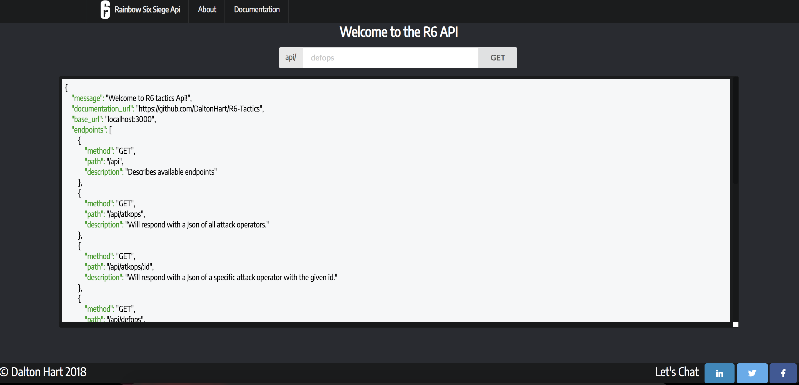

# Welcome to the R6 API

[Visit the live version!](https://boiling-fjord-73796.herokuapp.com/)

This Api is built around the game Rainbow Six Siege. It includes a variety of detailed endpoints with referencing. At the moment is holds 42 operators, 20 maps, all of their unique abilites, gadgets, and weapons.

This api is currently under maintence for extended endpoints that will be more restful and easier to call needed data.

## Available Endpoints

| Method  | URL| Output |
| ------| ----- | -----|
| GET  | /api  | Describes available endpoints. |
| GET  | /api/atkops  | Will respond with a Json of all attack operators. |
| GET  | /api/atkops/:id  | Will respond with a Json of a specific attack operator with the given id. |
| GET  | /api/defops  | Will respond with a Json of all defense operators. |
| GET  | /api/defops/:id  | Will respond with a Json of a specific defense operator with the given id.|
| GET  | /api/smaps  | Will respond with a Json of all available game maps.|
| GET  | /api/smaps/:id  | Will respond with a Json of a specific game map with the given id.|
| GET  | /api/gadgets  | Will respond with a Json of all game basic gadgets.|
| GET  | /api/gadgets/:id  | Will respond with a Json of a specific gadget with the given id.|
| GET  | /api/abilities | Will respond with a Json of all game operator abilities.|
| GET  | /api/abilities/:id | Will respond with a Json of a specific operator ability with the given id.|
| GET  | /api/weapons | Will respond with a Json of all game operator weapons.|
| GET  | /api/weapons/api | Will respond with a Json of a specific operator weapon with the given id.|

If you would like to recommend improvments to this rest api please leave an issue. Thank you and have fun building!